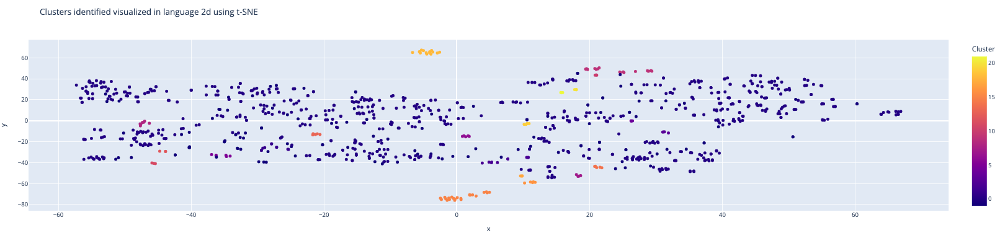
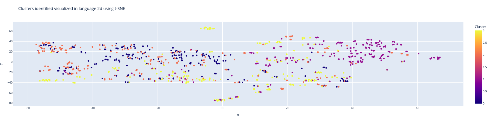

# Introduction

## Use Cases
- Migration Rationalization
- __Data Rationalization__ for
    - legacy mainframes
    - ERP's
    - Business Objects
    - BI Entities
- _Real Time_ Clustering and classification

> Workflow
- We generate `embeddings` from provided dataset `text-embedding-ada-002` model with an encoding base of `cl100k_base`.
- We cluster embeddings using techniques like `kmeans` or `DBSCAN` or `Spectral`. Evaluate clustering mechanisms using `Silhuoette` score.
- Similarity classification using `Levenshtein` distance for semantically coorelated `Fields`. This helps identify duplicates which are semantically similar in vector space.
- `gpt-3.5-turbo-16K` to summarize cluster definitions and generate a human-readble cluster theme.
- Plot themes as a network graph for better realization using `networkx` package.
- Use `RandomForest` classifier to evaluate viability of fine-tuning with this dataset for `real-time` clustering use cases, using metrics like `f1-score` and `confusion matrix`.

## Conclusions
This notebook covers use cases where your data is unlabelled/noisy but has indistinguishable features that can be used to cluster them into meaningful categories. The challenge with clustering is making the features that make those clusters stand out human-readable, and that is where we'll look to use `Large Language Models` to generate meaningful cluster descriptions for us. We can then use these to apply `labels` to a previously unlabelled dataset, classify the model for future `real-time` clustering and other related use cases.

# Kmeans

Clustering is one of the most common exploratory data analysis technique used to get an intuition about the structure of the data. It can be defined as the task of identifying subgroups in the data such that data points in the same subgroup (cluster) are very similar while data points in different clusters are very different. In other words, we try to find homogeneous subgroups within the data such that data points in each cluster are as similar as possible according to a similarity measure such as euclidean-based distance or correlation-based distance. The decision of which similarity measure to use is application-specific.

Kmeans algorithm is an iterative algorithm that tries to partition the dataset into Kpre-defined distinct non-overlapping subgroups (clusters) where each data point belongs to only one group. It tries to make the intra-cluster data points as similar as possible while also keeping the clusters as different (far) as possible. It assigns data points to a cluster such that the sum of the squared distance between the data points and the cluster’s centroid (arithmetic mean of all the data points that belong to that cluster) is at the minimum. The less variation we have within clusters, the more homogeneous (similar) the data points are within the same cluster.

# DBSCAN
### Why DBSCAN

__Challenges with $KMeans$__:

- __K-means__ clustering assumes that the data points are distributed in a spherical shape, which may not always be the case in real-world data sets. This can lead to suboptimal cluster assignments and poor performance on non-spherical data.
- __K-means__ clustering requires the user to specify the number of clusters in advance, which can be difficult to do accurately in many cases. If the number of clusters is not specified correctly, the algorithm may not be able to identify the underlying structure of the data.
- __K-means__ clustering is sensitive to the presence of outliers and noise in the data, which can cause the clusters to be distorted or split into multiple clusters.
- __K-means__ clustering is not well-suited for data sets with uneven cluster sizes or non-linearly separable data, as it may be unable to identify the underlying structure of the data in these cases.

__Advantages of $DBSCAN$__

- DBSCAN does not require the user to specify the number of clusters in advance.
- DBSCAN can handle data sets with varying densities and cluster sizes, as it groups data points into clusters based on density rather than using a fixed number of clusters.
- DBSCAN can identify clusters with arbitrary shapes, as it does not impose any constraints on the shape of the clusters.
- DBSCAN is robust to the presence of noise and outliers in the data, as it can identify clusters even if they are surrounded by points that are not part of the cluster.

# Spectral
### Why Spectral Clustering

- Spectral clustering does not require the user to specify the number of clusters in advance.
- Spectral clustering can handle data sets with complex or non-linear patterns, as it uses the eigenvectors of a similarity matrix to identify clusters.
- Spectral clustering is robust to the presence of noise and outliers in the data, as it can identify clusters even if they are surrounded by points that are not part of the cluster.
- Spectral clustering can identify clusters with arbitrary shapes, as it does not impose any constraints on the shape of the clusters.

# Classification Evaluation

## Silhouette Analysis

The silhouette coefficient or silhouette score kmeans is a measure of how similar a data point is within-cluster (cohesion) compared to other clusters (separation). The Silhouette score can be easily calculated in Python using the metrics module of the scikit-learn/sklearn library.

## Confusion Matrix and `f1` / `precision` score.

We will be using `embeddings` we generated to classify clusters. For many text classification tasks, we've seen fine-tuned models do better than embeddings but for the purposes of this exercise we will stick to `zero-shot` mechanisms as they tend to work better in `non-contiguous` scenarios.

In this text classification task, we predict the cluster based on provided field and description data. We split the dataset into a training and a testing set for all the following tasks, so we can realistically evaluate performance on unseen data. The dataset is created in `Data preparation` stage of this notebook.

The `criterion` in `RandomForestClassifiers` is a function that measures the quality of a split. Supported criteria are `gini` for the Gini impurity and `log_loss` and `entropy` both for the Shannon information gain.

> Kmeans example evaluation

